# سامانه مدیریت انبار سایپا

## معرفی پروژه

سامانه مدیریت انبار سایپا یک برنامه وب مدرن است که با نکست جی اس و ری اکت ساخته شده و هدف آن مدیریت هوشمند و بهینه عملیات انبار است. این سیستم شامل داشبوردهای تعاملی، نمودارها، فرم‌ها و گزارش‌ها بوده و کاملاً ریسپانسیو طراحی شده است.

## 📸 تصاویر پروژه

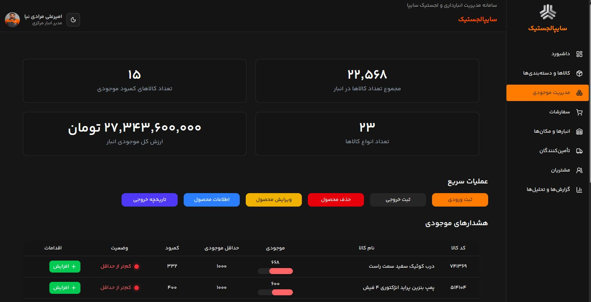
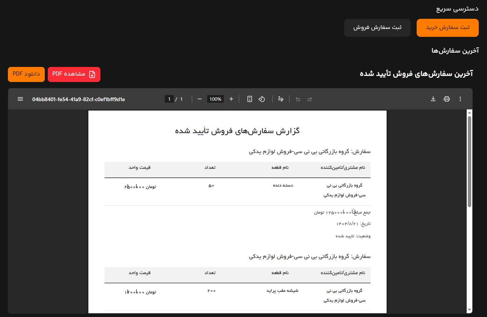
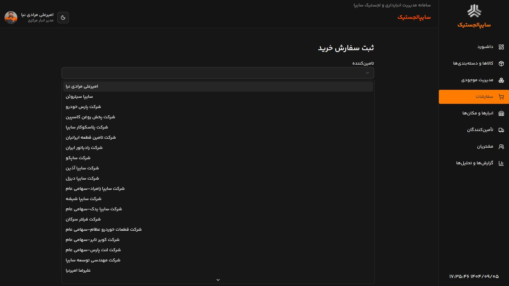
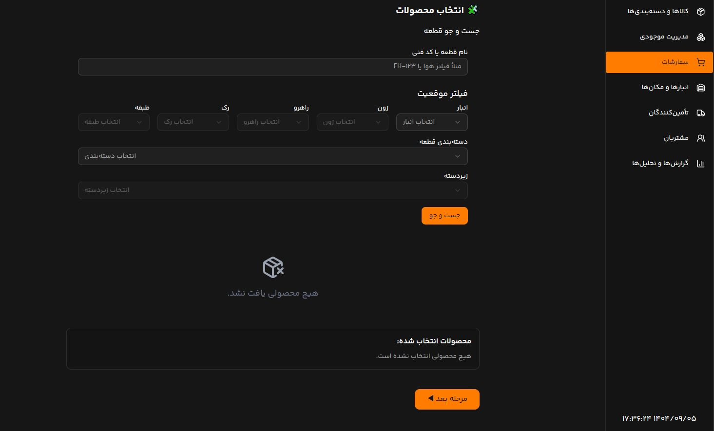
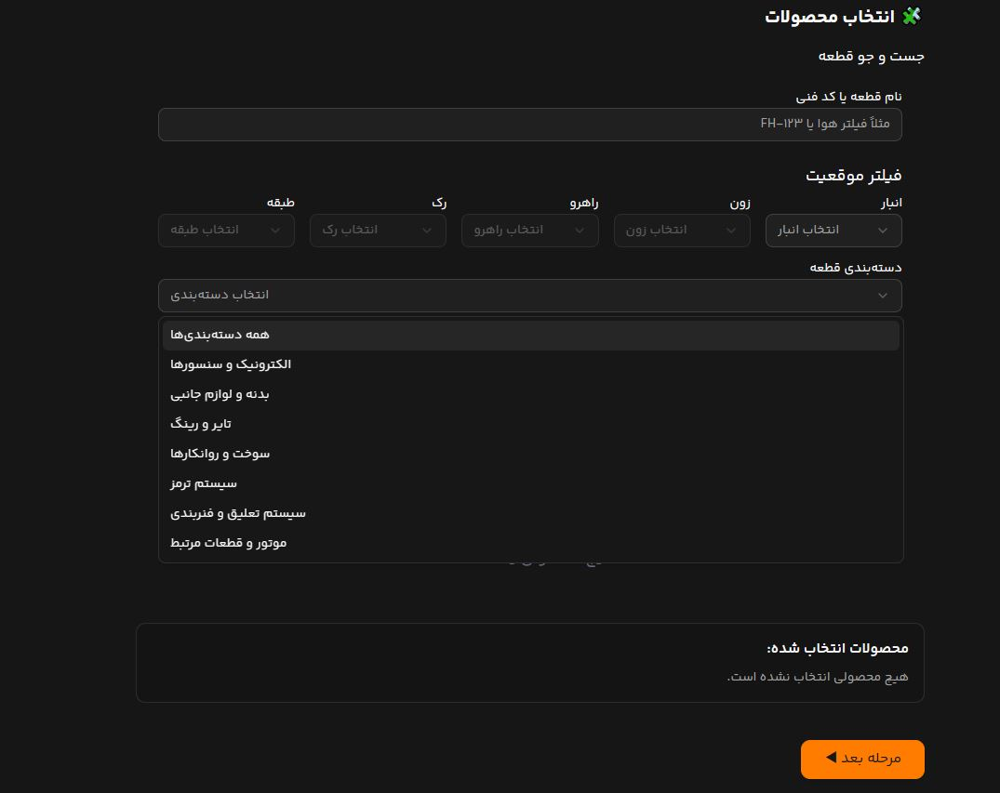
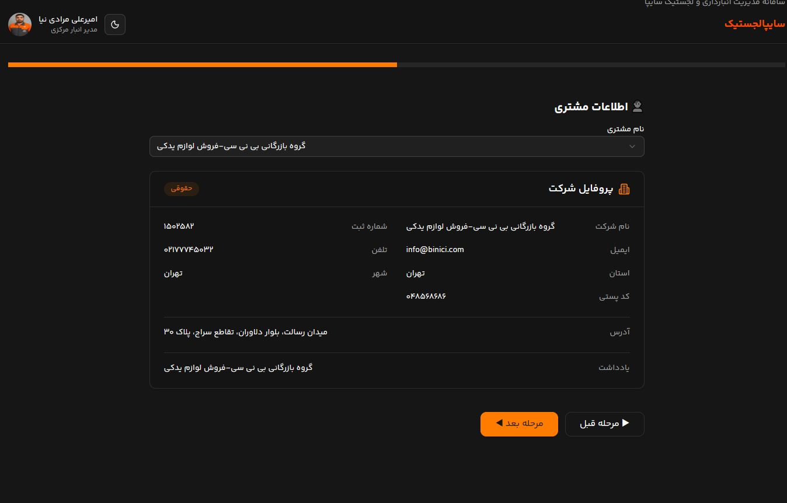
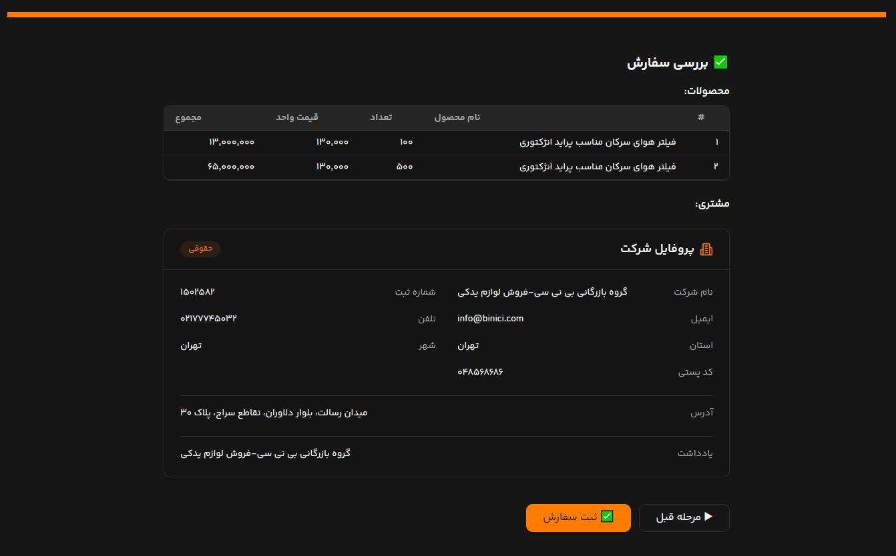
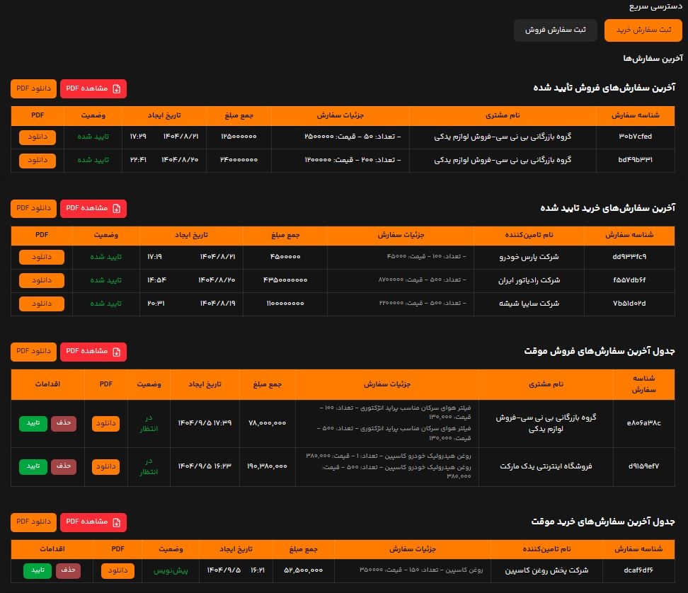
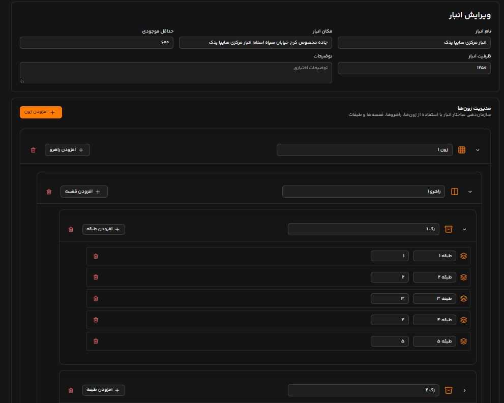

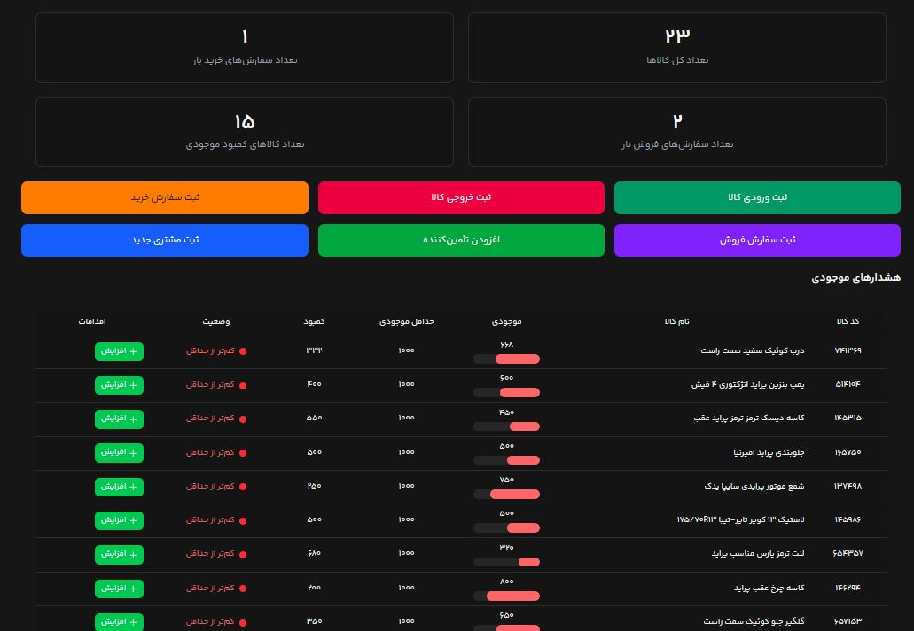
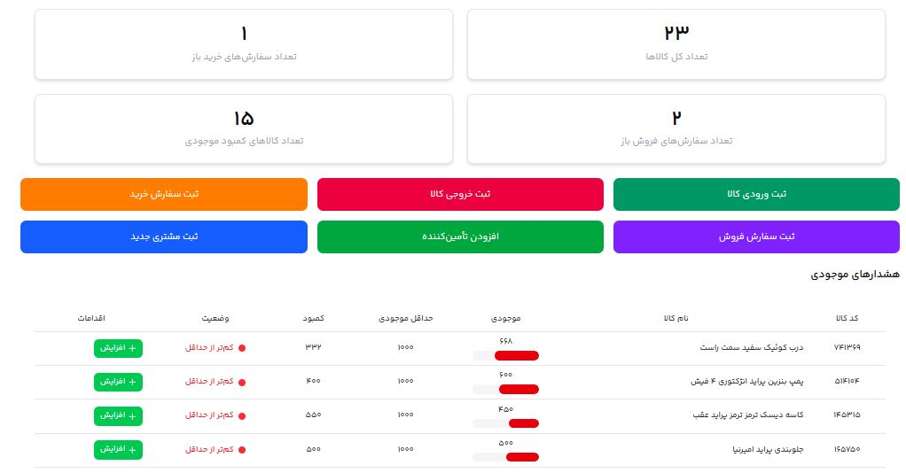
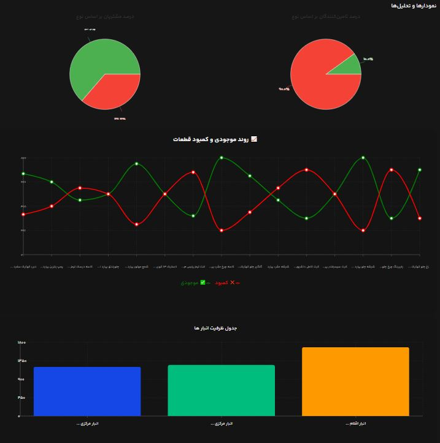

## 🛠 تکنولوژی‌های استفاده شده

- **Next.js 15.5.4** – فریم‌ورک React برای رندر سمت سرور و مسیر‌یابی
- **React 19.1.0** & **React DOM 19.1.0** – کتابخانه اصلی UI
- **Tailwind CSS 4** & **tw-animate-css 1.4.0** – استایل‌دهی سریع و انیمیشن‌ها
- **Shadcn UI / Radix UI** – کامپوننت‌های دسترس‌پذیر (Accordion, Select, Slider, Dialog, Tooltip و غیره)
- **React Hook Form 7.63.0** – مدیریت و اعتبارسنجی فرم‌ها
- **React Multi Date Picker 4.5.2** – انتخابگر تاریخ فارسی
- **Recharts 3.2.1** – نمودارها و نمایش داده‌ها
- **React Toastify 11.0.5** – نوتیفیکیشن‌ها
- **Framer Motion 12.23.22** – انیمیشن‌ها
- **@supabase/supabase-js 2.58.0** – اتصال به دیتابیس و backend
- **Prisma 6.18.0 & @prisma/client 6.18.0** – ORM برای پایگاه داده
- **Lucide React 0.544.0** – کتابخانه آیکون
- **UUID 13.0.0** – تولید شناسه‌های یکتا
- **Day.js, Jalaali-js, Jalaliday** – مدیریت تاریخ و پشتیبانی از تقویم فارسی

---

## ✨ قابلیت‌ها

داشبوردهای تعاملی برای مدیریت انبار

برای ورود مرحله ای به هر قسمت فرم**wizard** فرم های پویا با اعتبار سنجی کامل و قابلیت

- **Recharts**نمایش داده‌ها و گزارش‌ها با نمودارهای
- انتخاب تاریخ به صورت فارسی و چندتایی
- **PDF** تولید گزارش
- طراحی ریسپانسیو برای موبایل، تبلت و دسکتاپ
- پشتیبانی از **دارک مود و لایت مود**
- نوتیفیکیشن‌ها برای بازخورد سریع کاربر، **شخصی‌سازی شده با لوگوی شرکت سایپا**
- **Shadcn UI / Radix Ui** کامپوننت‌های دسترس‌پذیر و قابل استفاده مجدد با

### صفحات و امکانات جزئی

#### صفحه داشبورد

- مشاهده **کامپوننت آمار خلاصه وضعیت انبار** شامل:
  - **تعداد کل کالاها**
  - **تعداد کالاهای با موجودی کم**
  - **تعداد سفارش‌های خرید باز**
  - **تعداد سفارش‌های فروش باز**
- دسترسی سریع به عملیات مهم با **6 دکمه عملیاتی**:
  - ثبت **ورودی کالا**
  - ثبت **خروجی کالا**
  - ثبت **سفارش خرید**
  - ثبت **سفارش فروش**
  - افزودن **تامین‌کننده**
  - ثبت **مشتری جدید**
- مشاهده **جدول هشدارهای موجودی**:
  - نمایش قطعات با موجودی کم
  - دسترسی سریع به جزئیات و عملیات مرتبط با هر کالا

#### صفحه کالاها و دسته‌بندی‌ها

- **Pagination** جدول **کل قطعات موجود در انبار** با
- **کامپوننت فیلتر** کنار جدول برای جستجو و محدود کردن نمایش
- فیلتر کردن کالاها بر اساس **کتگوری** و **ساب‌کتگوری**
- نمایش **کامپوننت آمار انبار** شامل اطلاعات مهم مانند تعداد کل کالاها، ارزش کل موجودی و تعداد انواع کالاها

#### صفحه مدیریت موجودی

- لیست قطعات با **موجودی کم** (جدول هشدارهای موجودی)
- ثبت **ورودی کالا**
- ثبت **خروجی کالا**
- حذف محصول
- ویرایش محصول
- مشاهده **اطلاعات کامل محصول**
- مشاهده **تاریخچه خروجی‌ها**
- نمایش آمارهای مهم:
  - تعداد کالاهای با **موجودی کم**
  - **مجموع تعداد کل کالاها** در انبار
  - **تعداد انواع کالاها**
  - **ارزش کل موجودی انبار**

#### صفحه سفارش‌ها

- ثبت سفارش **خرید** (اضافه شدن کالا به انبار)
- ثبت سفارش **فروش** (کاهش موجودی از انبار)
- جدول **آخرین سفارش‌های فروش تأیید شده**
- جدول **آخرین سفارش‌های خرید تأیید شده**
- جدول **آخرین سفارش‌های خرید موقت**
- نمایش **آمار سفارش‌های تأیید شده** و **آمار سفارش‌های موقت** در بالای صفحه
- فارسی **PDF** امکان تولید

#### صفحه مشتریان

- لیست مشتریان با جداول مرتب

- روی مشتریان**RUD(READ,UPDATE,DELETE)** عملیات
- جدول توزیع مشتری‌ها بر اساس استان و شهر
- مشاهده آمار مشتری‌ها بر اساس استان و شهر
- مشاهده سابقه خرید و سفارش‌های قبلی مشتریان

#### صفحه تامین‌کنندگان

- لیست تامین‌کنندگان با جداول مرتب
- روی تامین کنندگان **Rud** عملیات
- بررسی دسته‌بندی و نوع تامین‌کنندگان
- مشاهده آخرین قطعات تأمین‌شده توسط هر تامین‌کننده در جدول جداگانه

#### صفحه انبار

- ایجاد انبار جدید (در صورتی که کالایی داخل انبار نباشد)
- ویرایش اطلاعات انبار
- حذف انبار
- مشاهده و مدیریت موجودی و کمبود قطعات

#### صفحه گزارش‌ها و تحلیل‌ها

- نمودار درصد مشتریان بر اساس نوع
- نمودار درصد تامین‌کنندگان بر اساس نوع
- روند موجودی و کمبود قطعات 📈
- جدول ظرفیت انبارها

#### سفارش‌های مشتریان

- مشاهده سوابق خرید مشتریان
- مدیریت سفارش‌ها

---

## 🚀 نصب و اجرای پروژه

```bash
git clone <repository-url>
cd saipa_warehouse_management_system
npm install
npm run dev       # اجرای سرور توسعه
npm run build     # ساخت نسخه تولید
npm run start     # اجرای نسخه تولید
```
